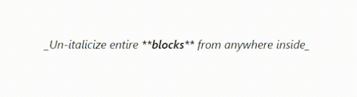
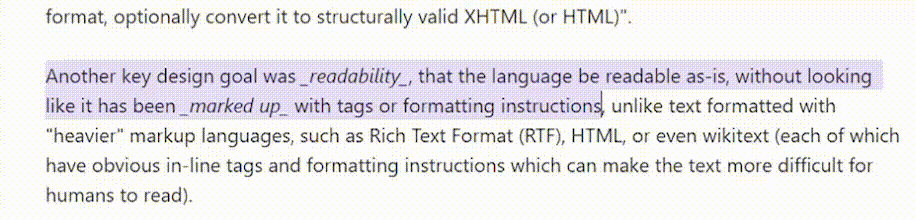

## Obsidian Plugin: Underscore Italics

Do you prefer using \__underscores_\_ for italics and **\*\*asterisks\*\*** for bold? Don't like how Obsidian's native commands force asterisk-based notation for both, with no option to customize this? This plugin is for you.

**Underscore Italics** gives you the option to choose which italics delimiter you prefer: asterisk or underscore. It provides a setting to choose which one is used by default, and provides a`Toggle italic` command that uses the character chosen.

While this plugin doesn't _override_ Obsidian's default toggle italic command, it can easily replace it by simply re-mapping the `Ctrl → I` shortcut (or whatever you use). 

While some other plugins have attempted this in the past, the problem is they didn't fully implement all the default features and behavior of Obsidian's built-in italic operation. I built this to be faithful to Obsidian's standard behavior, so this should mimic the functionality that you're used to, including **multi-cursor support** and **smart selection**. 

### Features

- Core italic toggling functionality
- Word selection (you don't need to first highlight a word you want to toggle)
- Smart syntax-aware expansion: 
  - Detects existing italic syntax using _both_ asterisks and underscores
  - Can quickly undo an italic section from any point inside of one 
- Uses clean CodeMirror transactions that don't pollute undo history
- Behaves reliably, as other existing syntax-aware commands do

### Usage

Use the command `Underscore Italics: Toggle italic` in the same way you would use the default `Toggle italic` command. 

**Recommendation**: Unmap the hotkey `Ctrl → I` and instead map it to `Underscore Italics: Toggle italic` 

### Installation
- Manual: (until the plugin has been published to the community tab, install with this method)
    - Create a folder named `underscore-italics` under `YOUR_VAULT_NAME/.obsidian/plugins`.
    - Download `manifest.json` and `main.js` from the latest [release](https://github.com/ianaf100/obsidian-underscore-italics/releases) and place them into the folder.
    - Enable it under "Installed plugins" in the "Community plugins" settings page.
- ~~In Obsidian~~
    - ~~Open 'Settings' → Community plugins' and turn off 'Restricted mode' if it is enabled~~
    - ~~Click 'Browse' and find 'Underscore Italics' by searching~~
    - ~~Click 'Install' and then 'Enable'~~

### Feature Roadmap
- [ ] Selection over multiple lines italicizes each line separately, detecting lists
- [ ] Change end-of-word behavior to be outside of the italics
- [ ] Expand built-in word parsing to handle apostrophes and other expanded characters
- [ ] Preferences to enable/disable specific italic behavior
- [ ] Provide an option for underscore __bold__ as well
- [x] Detect and trim addtional spacing automatically
- [x] Syntax expansion: an italic operation done *within* an existing italic section
- [x] Preserve correct anchor and head
- [x] Cursor offsets for multiple cursors need to be additive
- [x] Dynamically calculate offsets based on where the cursor is (before/inside/after the italics)

### Why?

Markdown has always supported [two syntaxes](https://daringfireball.net/projects/markdown/syntax#em) for bold and italic formatting: underscore and asterisk. For most cases they can be used interchangeably, however some (like me) prefer to differentiate the two. Using a consistent convention (specifically underscores as italics, in my opinion) makes the Markdown formatting much clearer and easier to parse when looking at the raw formatting in source mode. 
 
Certain organizations and style guides (such as [Google developer documentation style guide](https://developers.google.com/style/text-formatting)) actually specify preference of underscores for _italics_ and double-asterisk for **bold**. Additionally, certain nested formattings of bold and italic are not even possible without differentiating the two (which is even mentioned in [Obsidian's documentation](https://help.obsidian.md/syntax#Bold%2C+italics%2C+highlights)). Regardless of your preference, I believe you should be able to choose, which has personally bothered me. That's why I chose to make this as my first plugin. 
